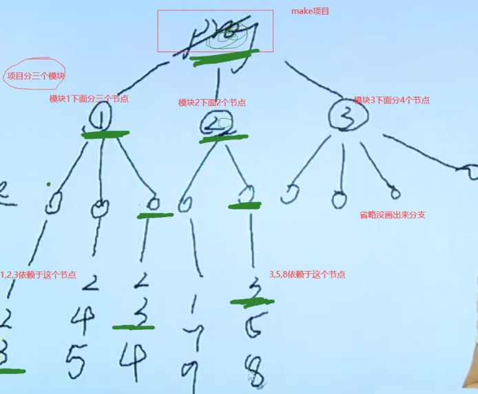

大家好，我是杂烩君。

本次我们来介绍关于Makefile的一些知识。

### 什么是make、Makefile？

make是一个 **`构建工具`**，主要用于C/C++项目。

Makefile是一个编译脚本，使用 **`make`** 工具解释Makefile（makefile）文件中的指令（编译指令）进行我们的项目编译。

在Linux环境下进行开发，工程源文件较少时，直接使用gcc进行编译。源文件较多及工程复杂时，就可以使用 **`Makefile（makefile）`** 来对我们的工程进行管理，然后使用 **`make`** 工具解释Makefile（makefile）文件中的指令（编译指令）进行我们的项目编译。即借助Makefile可以做到 **`自动化编译`** 。


###为何使用Makefile？
上面提到需要将我们写的大量项目文件管理起来，这里具体讲讲：


这个树形图展示了一个项目中的层级关系，如果我们需要变动3号文件，会发现，牵一发而动全身，改动一个被迫需要改动一堆，为了解放我们，make中编写Makefile就不再需要考虑这些，你把每个文件的依赖关系以指令的形式说明清楚并且保存下来，改动一个即可，会自动帮你修改关联到的其他文件。
### Makefile的实例

1、基础实例

万年不变helloworld，使用make编译hello.c。对应的Makefile文件：

```
hello:hello.c
gcc hello.c -o hello
```

2、[开源项目](https://so.csdn.net/so/search?q=%E5%BC%80%E6%BA%90%E9%A1%B9%E7%9B%AE&spm=1001.2101.3001.7020)实例

之前我们在[实践分享 | 基于framebuffer的lvgl的移植使用](https://mp.weixin.qq.com/s?__biz=MzU5MzcyMjI4MA==&mid=2247494528&idx=1&sn=cebcf7d7986d19d005968df1c5b1af9c&chksm=fe0e8547c9790c51372e870922a839def8a3f4f5c78478a879c8ae4ac625b0dd80e5f7d69f00&token=852026141&lang=zh_CN#rd)中也是使用Makefile来管理工程：

```
#
# Makefile
#
CC ?= gcc
LVGL_DIR_NAME ?= lvgl
LVGL_DIR ?= ${shell pwd}
CFLAGS ?= -O3 -g0 -I$(LVGL_DIR)/ -Wall -Wshadow -Wundef -Wmaybe-uninitialized -Wmissing-prototypes -Wno-discarded-qualifiers -Wall -Wextra -Wno-unused-function -Wundef -Wno-error=strict-prototypes -Wpointer-arith -fno-strict-aliasing -Wno-error=cpp -Wuninitialized -Wmaybe-uninitialized -Wno-unused-parameter -Wno-missing-field-initializers -Wtype-limits -Wsizeof-pointer-memaccess -Wno-format-nonliteral -Wno-cast-qual -Wunreachable-code -Wno-switch-default -Wno-switch-enum -Wreturn-type -Wmultichar -Wformat-security -Wno-ignored-qualifiers -Wno-error=pedantic -Wno-sign-compare -Wno-error=missing-prototypes -Wdouble-promotion -Wclobbered -Wdeprecated -Wempty-body -Wtype-limits -Wshift-negative-value -Wstack-usage=1024 -Wno-unused-value -Wno-unused-parameter -Wno-missing-field-initializers -Wuninitialized -Wmaybe-uninitialized -Wall -Wextra -Wno-unused-parameter -Wno-missing-field-initializers -Wtype-limits -Wsizeof-pointer-memaccess -Wno-format-nonliteral -Wpointer-arith -Wno-cast-qual -Wmissing-prototypes -Wunreachable-code -Wno-switch-default -Wswitch-enum -Wreturn-type -Wmultichar -Wno-discarded-qualifiers -Wformat-security -Wno-ignored-qualifiers -Wno-sign-compare
LDFLAGS ?= -lm
BIN = demo


#Collect the files to compile
MAINSRC = ./main.c

include $(LVGL_DIR)/lvgl/lvgl.mk
include $(LVGL_DIR)/lv_drivers/lv_drivers.mk
include $(LVGL_DIR)/lv_examples/lv_examples.mk

OBJEXT ?= .o

AOBJS = $(ASRCS:.S=$(OBJEXT))
COBJS = $(CSRCS:.c=$(OBJEXT))

MAINOBJ = $(MAINSRC:.c=$(OBJEXT))

SRCS = $(ASRCS) $(CSRCS) $(MAINSRC)
OBJS = $(AOBJS) $(COBJS)

## MAINOBJ -&gt; OBJFILES

all: default

%.o: %.c
@$(CC)  $(CFLAGS) -c $&lt; -o $@
@echo "CC $&lt;"
    
default: $(AOBJS) $(COBJS) $(MAINOBJ)
$(CC) -o $(BIN) $(MAINOBJ) $(AOBJS) $(COBJS) $(LDFLAGS)

clean: 
rm -f $(BIN) $(AOBJS) $(COBJS) $(MAINOBJ)
```

执行一个make命令很方便地就生成了可执行程序demo。

### Makefile的常用知识

前面分享了两个Makefile实例，大概知道Makefile里面都有些什么内容了。我们学习编程语言的时候，最开始都是先学习一些基本的概念及语法，同样的，对于Makefile，我们想要看懂Makefile文件或者要自己能修改、写出Makefile文件，自然也要学习一些Makefile的基本语法。

Makefile的内容很多，这里我们只专注于一些常用的Makefile知识点，基础知识掌握得牢固之后，其它一些冷门的、高级的用法我们在实践中遇到再去查资料学习也不迟。

就比如我们学习编程语言，有了基础之后，就可以去写代码实践了，而不是把厚厚的一本参考书的所有知识点都啃完之后采取动手，一下子输入太多知识而没有及时去实践巩固，就很容易忘记。

本文分享Makefile的如下几点常用知识：


#### 1、基本规则

Makefile文件中最重要的是规则。基本规则的格式如下：

```
# 基本规则
target:prerequisites 
    command
```

其中，**`target`** 为目标，**`prerequisites`** 为依赖。**`command`** 为make需要执行的命令。

> Makefile文件使用#进行注释。

-   目标：往往是程序的中间或者最终生成的文件名，比如目标文件、可执行文件等。
-   依赖：是指用来产生目标文件的输入文件名，一个目标往往依赖于一个或多个文件。
-   命令：是指任何一个文件发生改动之后，需要重新生成目标文件需要执行的命令，这里可以有多条命令，但是每个命令必须单独占一行，且需要注意的是，每个命令的前面必须有一个 **`<tab键>`** ，因为make是用过来识别命令行的，进而完成相应的动作。

对照着我们上面举例的两个Makefile文件，看看是不是都遵循着这样的规则。

#### 2、变量

Makefile中的变量与编程语言中的变量的概念有点不一样，跟C语言的宏倒是有些类似，用于记录一些信息，在Makefile被解析执行时，变量调用的地方就可以使用这些信息。特别是多处要用到同样的信息、用到较长的信息时，定义变量就很有优势。

##### （1）定义变量

定义变量有赋值的过程，Makefile提供了四种赋值方式，如：

```
# 直接给变量赋值。
VAR = xxx
# 是在该变量没有被赋值的情况下为其赋值。
VAR ?= xxx
# 将":="右边中包含的变量直接展开给左边的变量赋值。
VAR := xxx
# 追加赋值，可以往变量后面增加新的内容。
VAR += xxx
```

定义及使用变量：

```
# 定义变量
VAR = xxx
# 使用变量
$(VAR)
```

对于以上四种赋值方式，一个简单易懂的例子：

```
例子：
a = 1
b = 2
c := $(a) 3
d = 4
d ?= 5
b += 6
结果：
a=1
c=1 3
d=4
b=2 6
```

##### （2）内置变量

Make命令提供一系列内置变量，常用的有：

| 变量名 | 说明 |
| --- | --- |
| CURDIR | 当前路径 |
| CC | C语言编译器的名称 |
| CPP | C语言预处理器的名称 |
| CXX | C++语言的编译器名称 |
| RM | 删除文件程序的名称 |
| CFLAGS | C语言编译器的编译选项，无默认值 |
| CPPFLAGS | C语言预处理器的编译选项，无默认值 |
| CXXFLAGS | C++语言编译器的编译选项，无默认值 |

更多内置变量，可查阅：

> https://www.gnu.org/software/make/manual/html\_node/Implicit-Variables.html

#### 3、分支判断

Makefile中，分支判断有如下几种情况：

-   ifeq：判断参数是否不相等，相等为 true，不相等为 false。
-   ifneq：判断参数是否不相等，不相等为 true，相等为 false。
-   ifdef：判断是否有值，有值为 true，没有值为 false。
-   ifndef：判断是否有值，没有值为 true，有值为 false。

使用方法类似C语言中的if用法。格式如：

```
ifeq (ARG1, ARG2)
...
else
...
endif
```

例如根据不同的CPU架构选择不同的编译器：

```
ARCH ?= x86
ifeq ($(ARCH),x86)
CC = gcc
else
CC = arm-linux-gnueabihf-gcc
endif

hello:hello.c
$(CC) hello.c -o hello
@echo $(CC)
```

> 在echo前面加上echo可以关闭回显。

上面这一段Makefile中的变量arch的值默认为x86，我们也可以在执行make命令时指定变量的值，就可以在不修改Makefile文件的情况下灵活地切换编译器，如：

```
make ARCH=x86
make ARCH=arm
```

#### 4、头文件依赖

有些工程用，各模块有自己的一个Makefile文件，提供给工程总的Makefile文件使用。总的Makfile文件可以使用关键字 **`include`** 包含其它Makefile文件，格式如：

```
include &lt;filenames&gt;
```

例如上面实例中的：

```
include $(LVGL_DIR)/lvgl/lvgl.mk
include $(LVGL_DIR)/lv_drivers/lv_drivers.mk
include $(LVGL_DIR)/lv_examples/lv_examples.mk
```

#### 5、显示规则与隐式规则

##### （1）显示规则

**`显式规则`**。显式规则说明了，如何生成一个或多的的目标文件。这是由 Makefile 的书写者明显指出，要生成的文件，文件的依赖文件，生成的命令。如

```c
hello:hello.o gcc hello.o -o hello
```

这就是一条显示规则。工程较简单时，常常使用显示规则来编写Makefile。但工程的结构比较复杂时，Makefile文件中常常会穿插着一些隐式规则来简化Makefile。下面看看是什么时隐式规则。

##### （2）隐式规则

**`隐式规则`** 。隐含规则是系统或用户预先定义好的一些特殊规则，主要是一些常用的依赖关系和更新命令。隐含规则中出现的目标文件和依赖文件都只使用文件的扩展名。

如果Makefile 文件里面没有显式给出文件的依赖关系的时候，make 就会根据文件的扩展名找到相应的隐含规则，然后按照隐含规则来更新目标。隐式规则的例子如：

```c
hello:hello.o $(CC) $^ -o $@
```

其中，**`$@`** 代表了目标文件 ，**`$<`** 代表了所有依赖文件。其中， **`$@`** 与 **`$<`** 也称作系统的 **`自动化变量`** 。类似的还有如下几个常用的自动化变量：

-   $%：与 $@ 类似，但 $% 仅匹配“库”类型的目标文件。
-   $<：依赖中的第一个目标文件。
-   $^：所有的依赖文件。
-   $+：所有的依赖目标，即使依赖中有重复的也原样保留。
-   $?：所有比目标要新的依赖目标。

#### 6、实目标与伪目标

Makefile 文件中的目标分为两类：实目标和伪目标。

##### （1）实目标

实目标是真正要生成的以文件形式存放在磁盘上的目标。如：

```
hello:hello.o
    $(CC) $^ -o $@ 
```

其中，**`hello`** 文件就是实目标。

##### （2）伪目标

伪目标不要求生成实际的文件，它主要是用于完成一些辅助操作。如：

```
clean:
    rm -rf hello.o hello
```

其中的 **`clean`** 就是一个伪目标。我们在命令里面输入命令： **`make clean`** 就可以执行删除操作：

```
rm -rf hello.o hello
```

但是这种书写形式不是很严谨，因为可能在当前目录下面存在文件名为 clean 的文件，因为这时候， 后面没有依赖文件，所以make 就认为这个文件是最新的，所以就不会执行 **`rm -rf hello.o hello`** 。所以为了避免这种情况的发生，Makefile使用\*\*`.PHONY`\*\* 来区分伪目标，使用如：

```
.PHONY:clean
clean:
    rm -rf hello.o hello
```

使用 **`.PHONY`** 说明clean是一个伪目标。

类似 **`.PHONY`** 这样的特殊的内置目标名称还有很多，可查阅：

> https://www.gnu.org/software/make/manual/html\_node/Special-Targets.html#Special-Targets

#### 7、函数

Makefile中有很多使用的内置函数，借助这些函数可以使我们的Makefile更为简洁。Makefile函数的调用方式与使用变量的方式类似，如：

```
$(函数名 参数)
```

或者：

```
${函数名 参数}
```

下面介绍一些常用的函数：

##### （1）wildcard函数

wildcard函数用于获取文件列表，并使用空格分隔开。语法如：

```
$(wildcard 匹配规则)
```

例如我们有如下工程：


我们可以使用wildcard函数获取src文件夹下的文件：

```
SRC_FILES = $(wildcard src/*.c)

target1:
@echo $(SRC_FILES)
```


##### （2）patsubst函数

patsubst函数功能为模式字符串替换。语法如：

```
$(patsubst 匹配规则, 替换规则, 输入的字符串)
```

patsubst函数看起来貌似有点复杂，不做过多解释，看个例子就知道什么意思了。还是使用上面的例子：

```
OBJ_FILES = $(patsubst %.c, %.o, hello.c)

target1:
@echo $(OBJ_FILES)
```


我们输入的hello.c符合匹配规则\*\*`%.c`**，所以按照替换规则**`%.o`\*\*进行替换得到hello.o。

> %是一个通配符，用于匹配任意个字符。

##### （3）subst函数

subst函数功能为字符串替换。语法如：

```
$(subst 源字符串, 目标字符串, 输入的字符串)
```

例子：

```
INPUT_STR = hello world
OUTPUT_STR = $(subst hello, HELLO, $(INPUT_STR))

target1:
@echo $(OUTPUT_STR)
```


subst函数把输入字符串 **`hello world`** 中的源字符串hello替换成目标字符串HELLO。

##### （4）notdir函数

notdir函数用于去除文件路径中的目录部分。语法如：

```
$(notdir 文件名)
```

使用上面的例子来演示：

```
SRC_FILES = $(notdir src/src1.c)

target1:
@echo $(SRC_FILES)
```


notdir函数去掉了src/src1.c前面的路径src/，输出src1.c。这里只是输出了一个文件，我们可以与上面的wildcard函数结合使用输出多个文件，如：

```
SRC = $(wildcard src/*.c)
SRC_FILES = $(notdir $(SRC))

target1:
@echo $(SRC_FILES)
```


先是使用wildcard函数获取带有路径的文件列表，再使用notdir函数去掉前面的路径。

更多内置函数可查阅：

> https://www.gnu.org/software/make/manual/html\_node/Functions.html

### 练习

根据我们上面学习的知识，我们可以来练习给如下工程编写一个Makefile文件：


**Makefile：**

```
# 默认架构
ARCH ?= x86

# 源文件目录
SRCS_DIR = src

# 头文件目录
INCS_DIR = inc

# 编译输出目录
BUILD_DIR = build

# 源文件
SRCS = $(wildcard $(SRCS_DIR)/*.c)

# 头文件
INCS = $(wildcard $(INCS_DIR)/*.h)

# 目标文件
OBJS = $(patsubst %.c, $(BUILD_DIR)/%.o, $(notdir $(SRCS)))

# C编译选项，显示警告
CFLAGS = -Wall

# 目标APP
TARGET_APP = hello_makefile

# 根据ARCH选择编译器
ifeq ($(ARCH), x86)
CC = gcc
else
CC = arm-linux-gnueabihf-gcc
endif

# 链接
$(BUILD_DIR)/$(TARGET_APP):$(OBJS) 
$(CC) -o $@ $^ -I$(INCS_DIR) $(CFLAGS)

# 编译
$(BUILD_DIR)/%.o:$(SRCS_DIR)/%.c $(INCS)
@mkdir -p $(BUILD_DIR)
$(CC) -c -o $@ $&lt; -I$(INCS_DIR) $(CFLAGS)

# 清除
.PHTHY:clean
clean:
rm -rf $(BUILD_DIR)
```

以上就是本次的分享，学习了这些Makefile基础知识之后，我们就可以看懂很多工程的Makefile文件。当然，Makefile知识很多，本文并未列出，实际遇到的时候可以再去查阅相关资料，如：

-   https://www.gnu.org/software/make/manual/
    
-   https://blog.csdn.net/haoel/article/details/2886/
    
-   http://c.biancheng.net/view/7161.html
    
-   http://www.ruanyifeng.com/blog/2015/02/make.html
    
-   https://doc.embedfire.com/linux/imx6/base/zh/latest/linux\_app/makefile.html#